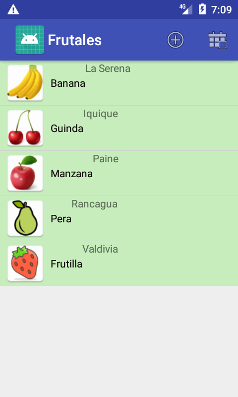
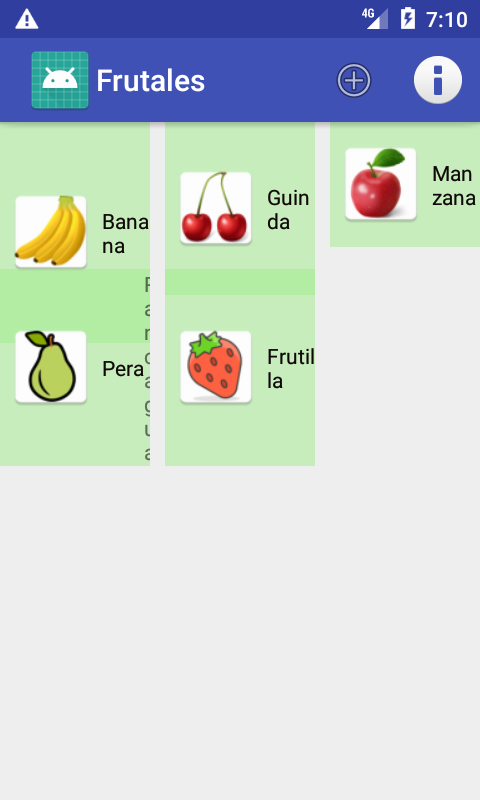
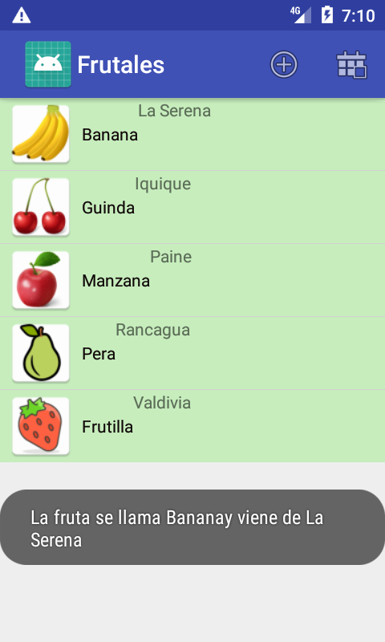
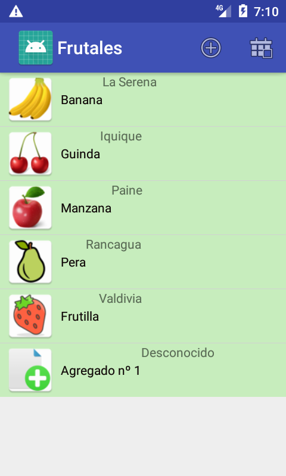
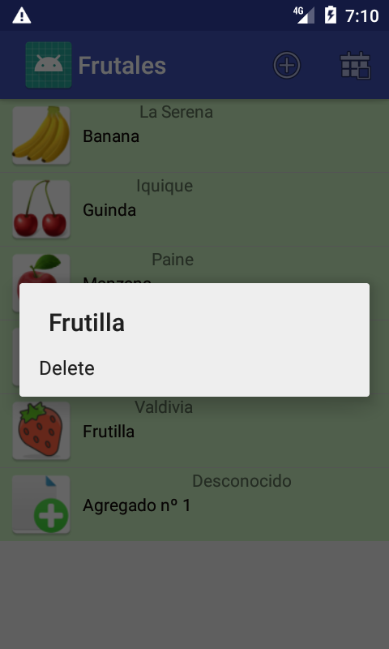

# AndroidListaFruta

Este es una aplicacion hecho en android donde el usuario obtiene una lista de frutas que tiene en su casa, en ello puede ver el contenido de las frutas en forma de listado si presiona en el boton derecho superior o en su debido caso presiona el mismo boton para ver el contenido en forma de grillas

 

